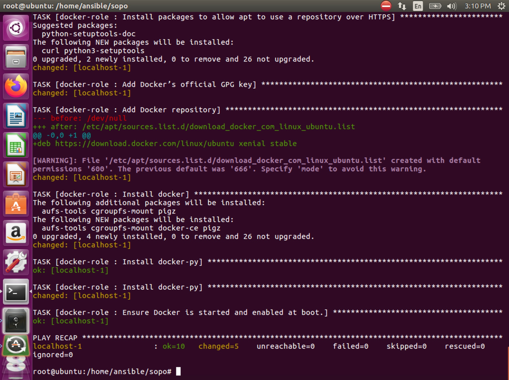

# sopo

Куча магии и настроек которые я уже забыл , прокидывание ключей на машину и тд, делал давно простите((

Команды что помню

1. ansible-galaxy install -r roles/requirements.yml --force. (чтобы докер роль стянуть)
2. ansible-playbook -i environments/localhost/inventory playbooks/docker.yml -D (прокатить плейбук по машинам законфиганым)

